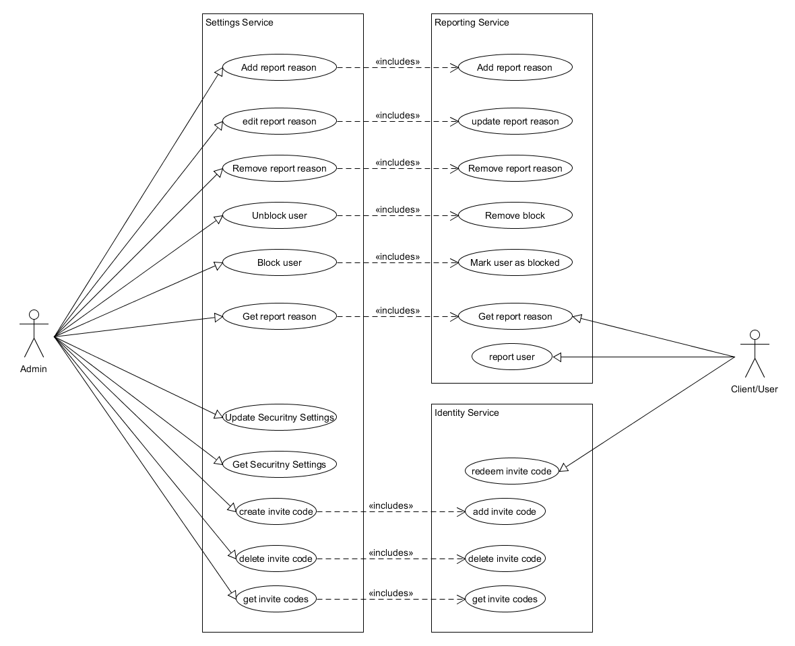

#Settings
- [Description](#description)
- [Rest interfaces](#Rest interfaces)
- [Example use case execution](#Example Add Report reason)

## Description
The Settings service provides an interface to the admin panel frontend and carries out the settings to the other services
As visible from the [Use Case diagram](#Use case diagram) the Settings service carries out a few tasks by itself whilst forwarding certain other request to the [identity service](identity-service.md) and the [reporting service](reporting.md).

#### Use Case Diagram


###Rest interface
```
GET: /settings/report-reason
```
Returns all report reasons as a JSON array

```
POST: /settings/report-reason
body:
{
    "reason": "some reason",
    "max_report_violations": 5
}
```
adds a new report reason

```
PUT: /settings/report-reason
body:
{
    "id": 123,
    "reason": "some reason",
    "max_report_violations": 5
}
```
Edits an existing report reason

```
DELETE: /settings/report-reason
headers:
    - "id": 123
```
Deletes a report reason with an id that is provided as a header


```
GET: /settings/security
```
returns the current security settings
```
PUT: /settings/security
body:
{
  "two_factor_auth": {
    "on" : true,
    "phone": false,
    "email": true
  },
  "confirmed_emails_only": true,
  "individual_pwd_req": {
    "on": true,
    "upper_case": true,
    "number": true,
    "special_char": true,
    "reg_ex": false,
    "reg_ex_string": "[]"
  },
  "inv_only": {
    "on": false,
    "inv_only_by_adm": false
 }
}
```
Edits the security settings. The new settings are provided in body.
##Example Add Report reason

The sequence diagram shows an example of the communication of the settings service with the aforementioned services.
Firstly by checking at the identity service, if the user who sent out the request is in fact an administrator and then adding the reason in the reporting service.
This way each service has a clearly defined task.
