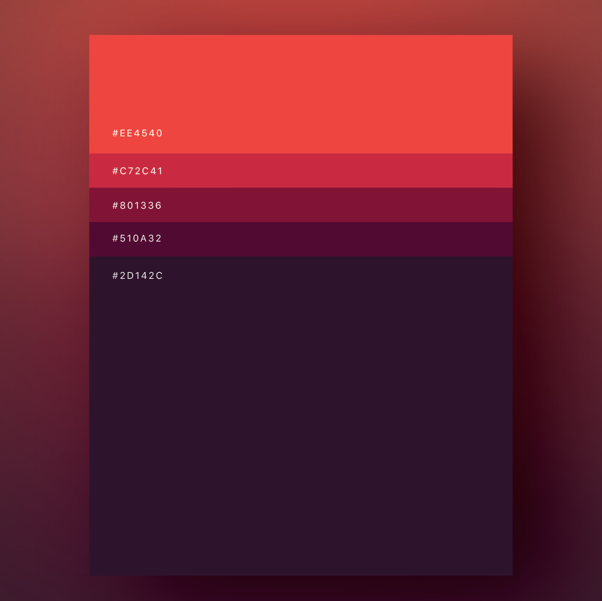
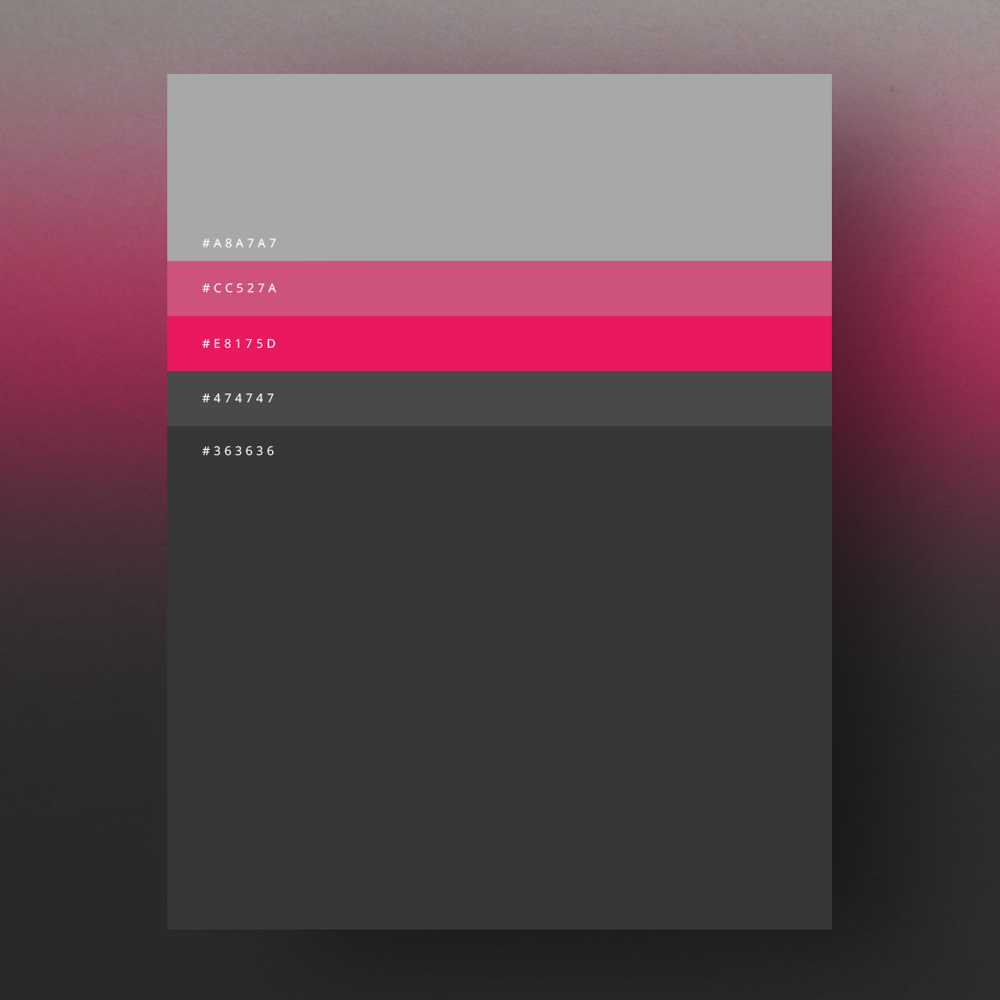

### 1. Color Palette (primary)

<table>
    <tr>
        <th>
            Color Name
        </th>
        <th>
            HEX Code
        </th>
        <th></th>
    </tr>
    <tr>
        <td>
            Coral red
        </td>
        <td>
            #EE4540
        </td>
        <td style="background-color: #EE4540"></td>
    </tr>
    <tr>
        <td>
            French rasperry
        </td>
        <td>
            #C72C41
        </td>
        <td style="background-color: #C72C41"></td>
    </tr>
    <tr>
        <td>
            Boysenberry
        </td>
        <td>
            #801336
        </td>
        <td style="background-color: #801336"></td>
    </tr>
    <tr>
        <td>
            Plum violet
        </td>
        <td>
            #510A32
        </td>
        <td style="background-color: #510A32"></td>
    </tr>
    <tr>
        <td>
            Elderberry
        </td>
        <td>
            #21142D
        </td>
        <td style="background-color: #21142D"></td>
    </tr>
</table>

### 2. Color Palette (secondary)

